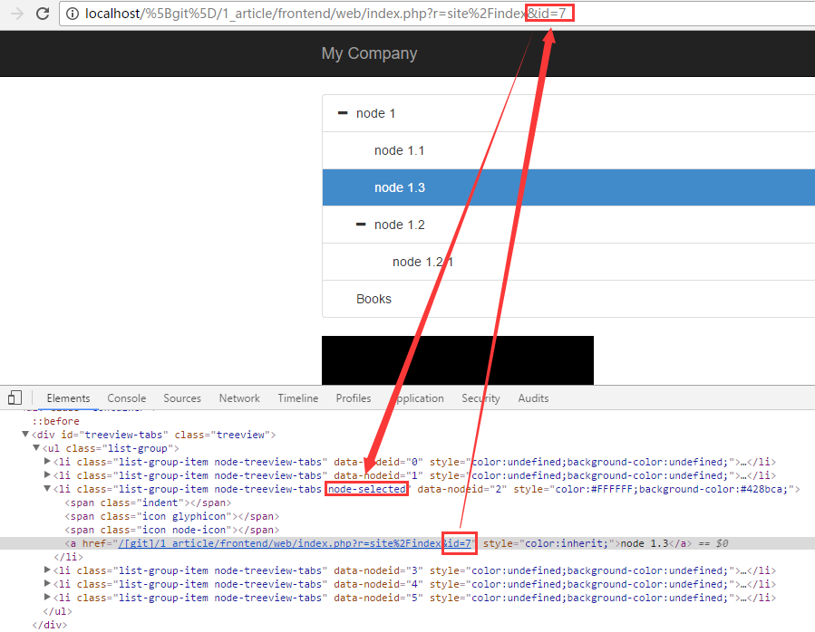

# yii2-bootstrap-tree release version 1.0.0

A bootstrap tree for both jonmiles bootstrap treeview 1.2.0 and 2.0.0 (https://github.com/jonmiles/bootstrap-treeview).
Forked and improved from `https://github.com/dmitry-suffi/yii-tree-widget` and `https://github.com/lesha724/yii2-bootstrap-tree`.

[](https://packagist.org/packages/yongtiger/yii2-bootstrap-tree)
[](https://packagist.org/packages/yongtiger/yii2-bootstrap-tree) 
[](https://packagist.org/packages/yongtiger/yii2-bootstrap-tree)
[](https://packagist.org/packages/yongtiger/yii2-bootstrap-tree)


## FEATURES

* for both jonmiles bootstrap treeview 1.2.0 and 2.0.0 (https://github.com/jonmiles/bootstrap-treeview)
* automatically displaying selected nodes according to route/params (e.g. `id`) 


## DEPENDENCES

* jonmiles bootstrap treeview 1.2.0 and 2.0.0 (https://github.com/jonmiles/bootstrap-treeview)


## INSTALLATION   

The preferred way to install this extension is through [composer](http://getcomposer.org/download/).

Either run

```
php composer.phar require --prefer-dist yongtiger/yii2-bootstrap-tree "*"
```

or add

```json
"yongtiger/yii2-bootstrap-tree": "*"
```

to the require section of your composer.json.


## CONFIGURATION


## USAGES

### Example of data.$items structure (https://github.com/jonmiles/bootstrap-treeview#data-structure):

```php
$items = [
    [
        'text' => 'Node 1',
        'href' => ['site/index', id => 1],  ///Note: href must be route array!
        'icon' => 'glyphicon glyphicon-stop',
        'selectedIcon' => "glyphicon glyphicon-stop",
        'selectable' => true,
        'state' => [
            // 'checked' => true,
            // 'disabled' => true,
            // 'expanded' => true,
            // 'selected' => true,
        ],
        'tags' => ['available'],
        //...,
        'nodes' =>
        [
            ['text' => 'Node 1.1', 'href' => ['site/index', id => 2]],
            ['text' => 'Node 1.2', 'href' => ['site/index', id => 3]],
        ]
    ],
    [
        'text' => 'Node 2',
        'href' => ['site/index', id => 4],
        'nodes' => [
            ['text' => 'Node 2.1', 'href' => ['site/index', id => 5]],
            ['text' => 'Node 2.2', 'href' => ['site/index', id => 6]],
        ]
    ]
];
```

```php
echo \yongtiger\bootstraptree\widgets\BootstrapTree::widget([
    'options'=>[
        //https://github.com/jonmiles/bootstrap-treeview#options
        'data' => $items,   ///(needed!)
        'enableLinks' => true,  ///(optional)
        'showTags' => true, ///(optional)
        'levels' => 3,  ///(optional)
        'multiSelect' => true,  ///(optional, but when `selectParents` is true, you must also set this to true!)
    ],
    'htmlOptions' => [  ///(optional)
        'id' => 'treeview-tabs',
    ],
    'events'=>[	///(optional)
        //https://github.com/jonmiles/bootstrap-treeview#events
        'onNodeSelected'=>'function(event, data) {
            // Your logic goes here
            alert(data.text);
        }'
    ],

    ///(needed for using jonmiles bootstrap-treeview 2.0.0, must specify it as `<a href="{href}">{text}</a>`)
    'textTemplate' => '<a href="{href}">{text}</a>',

    ///(optional) Note: when it is true, you must also set `multiSelect` of the treeview widget options to true!
    'selectParents' => true,
]);
```


### Other usages are just same as [yii\widgets\Menu](http://www.yiiframework.com/doc-2.0/yii-widgets-menu.html).

- `textTemplate` is same as [yii\widgets\Menu::labelTemplate](http://www.yiiframework.com/doc-2.0/yii-widgets-menu.html#$labelTemplate-detail)

    Note: for using jonmiles bootstrap-treeview 2.0.0, must specify it as `<a href="{href}">{text}</a>`

- `encodeTexts` is same as [yii\widgets\Menu::encodeLabels](http://www.yiiframework.com/doc-2.0/yii-widgets-menu.html#$encodeLabels-detail)

- `selectNodes` is same as [yii\widgets\Menu::activateItems](http://www.yiiframework.com/doc-2.0/yii-widgets-menu.html#$activateItems-detail)

- `selectParents` is same as [yii\widgets\Menu::activateParents](http://www.yiiframework.com/doc-2.0/yii-widgets-menu.html#$activateParents-detail)

    Note: when it is true, you must also set `multiSelect` of the treeview widget options to true!

- `hideEmptyNodes` is same as [yii\widgets\Menu::hideEmptyItems](http://www.yiiframework.com/doc-2.0/yii-widgets-menu.html#$hideEmptyItems-detail)

- `route` is same as [yii\widgets\Menu::route](http://www.yiiframework.com/doc-2.0/yii-widgets-menu.html#$route-detail)

- `params` is same as [yii\widgets\Menu::params](http://www.yiiframework.com/doc-2.0/yii-widgets-menu.html#$params-detail)


## NOTES


## DOCUMENTS


## REFERENCES

- https://github.com/dmitry-suffi/yii-tree-widget
- https://github.com/lesha724/yii2-bootstrap-tree


## SEE ALSO


## TBD


## [Development roadmap](docs/development-roadmap.md)


## LICENSE 
**yii2-bootstrap-tree** is released under the MIT license, see [LICENSE](https://opensource.org/licenses/MIT) file for details.
